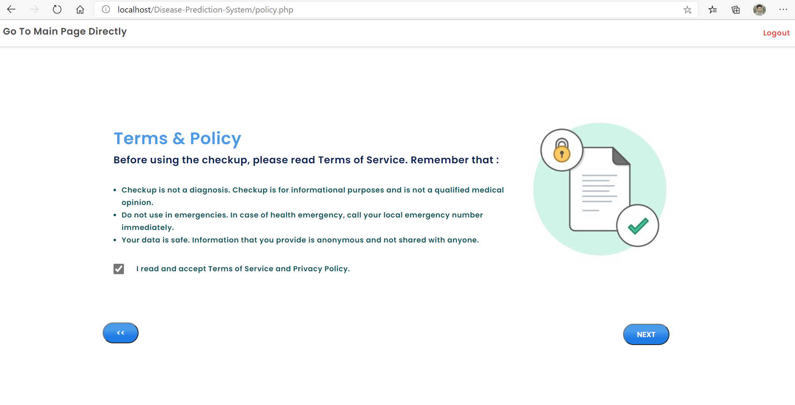
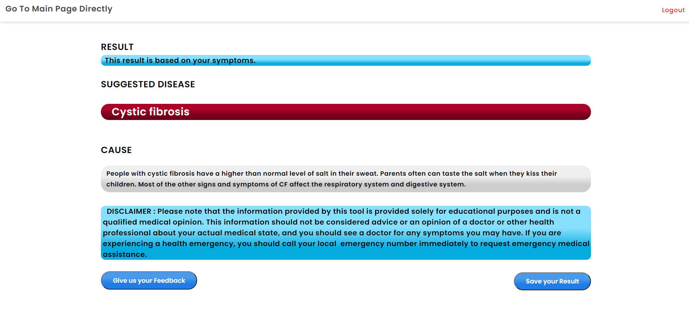

# Disease-Prediction-System using PHP.

This project aims to predict the disease based on your symptoms. Here, I use Html, CSS, JavaScript, PHP, MySql, and JQuery.Before Entering the project first insert the database into the sql database . The database file is included in the project.

## Here, I am trying to do this project using core PHP.

# # # # Project Description: This Project predicts the disease based on your symptoms. After Entering the system you can Login or Registration. Login is not mandatory to check for disease. First you have to select the portion of your body which you feel bad.Then After selecting some symptoms, you can get the result.

#### Restriction: You can only check the front part of your body. This is Only for the Male body.

#### Cautions: You Cannot surely 100% sure that this is the right disease. It analyzes the symptoms and, based on those symptoms, produces output.

#### 

##### Note: This Project is Not fully Responsive 

##### For log in or you can Registration 

For Admin Login UserName: admin 
                Password: Ab123456

For User Login Username: user
               Password: Ab123456

#### Some Samples of this project are given below :

